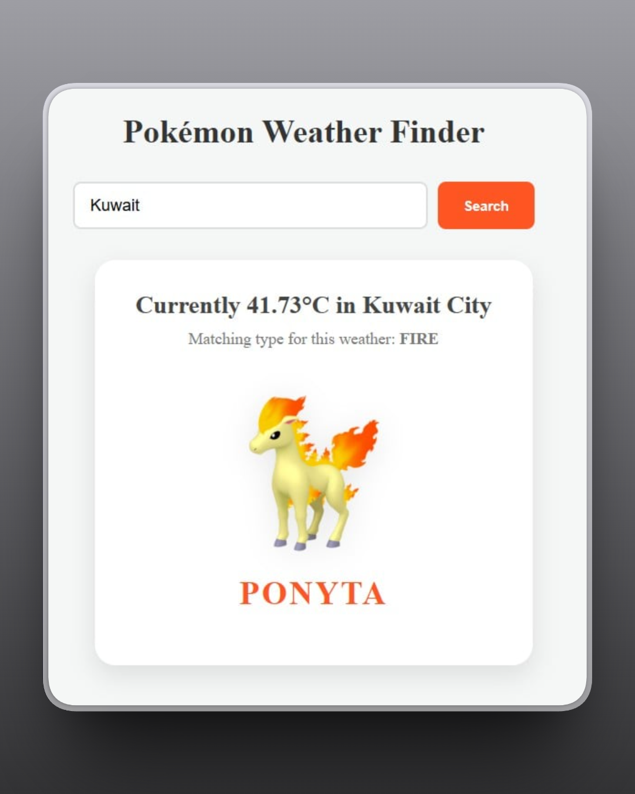
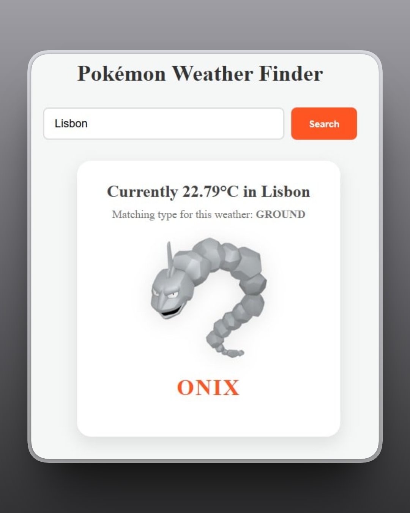
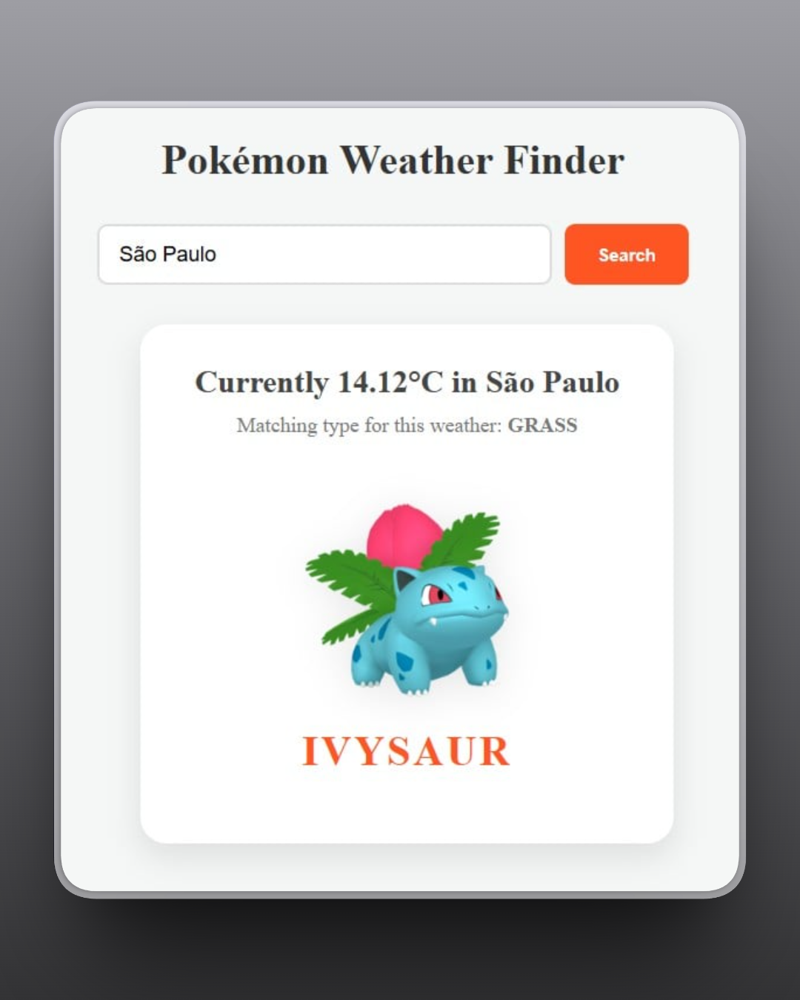
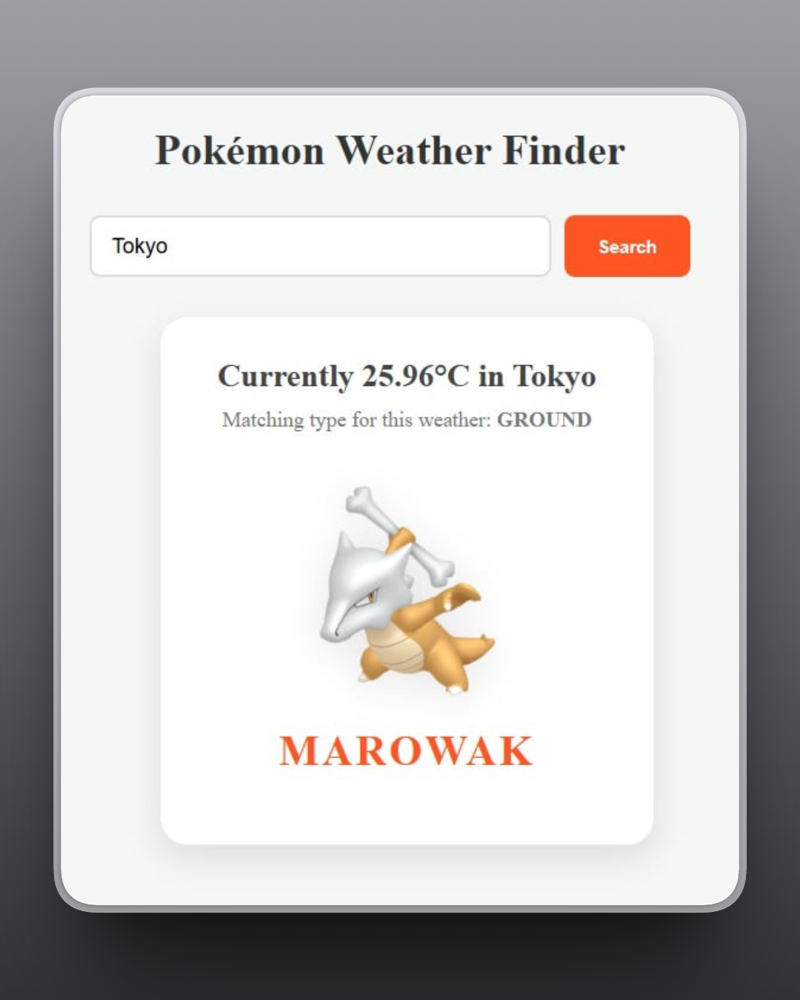
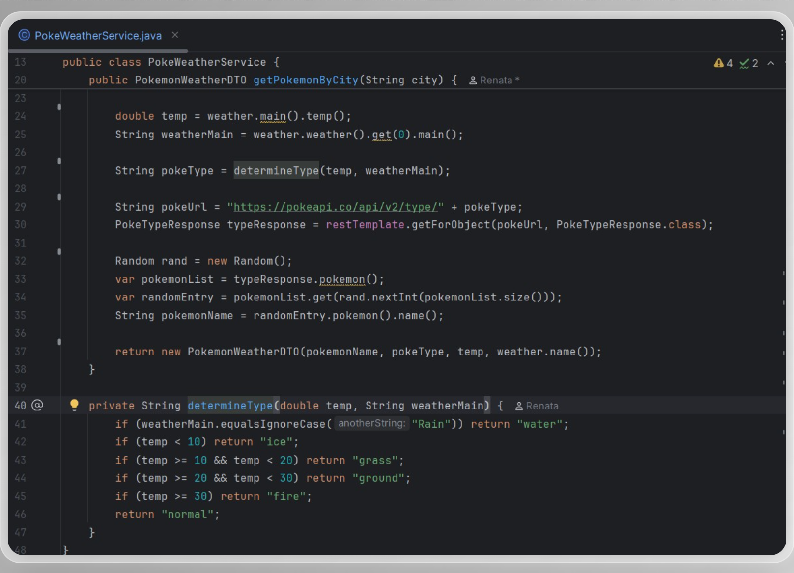
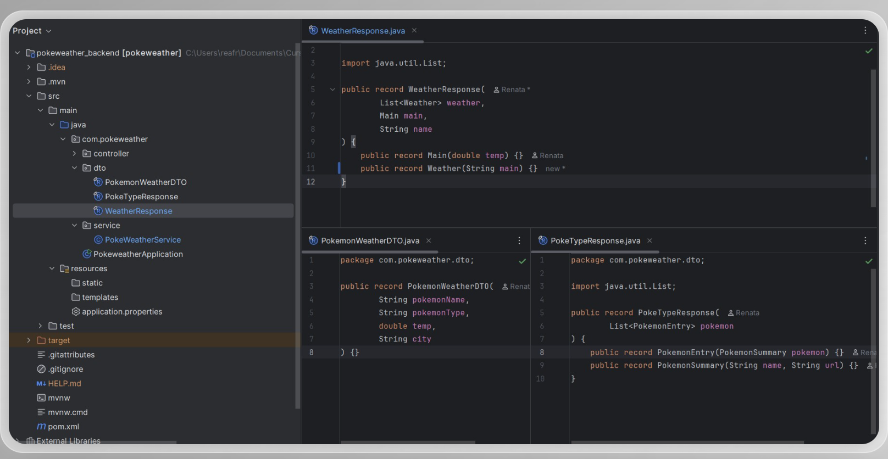
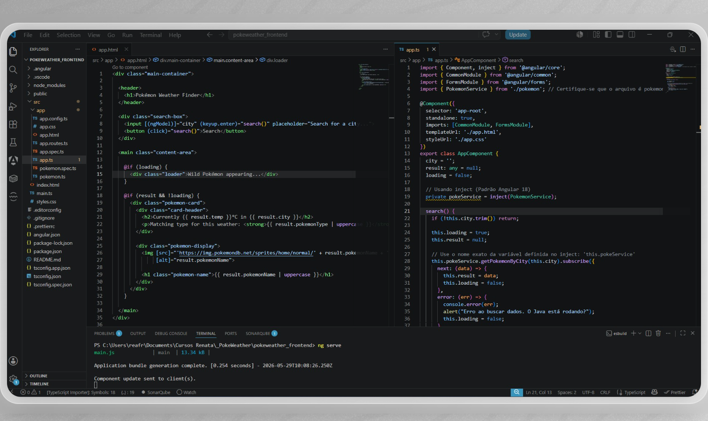
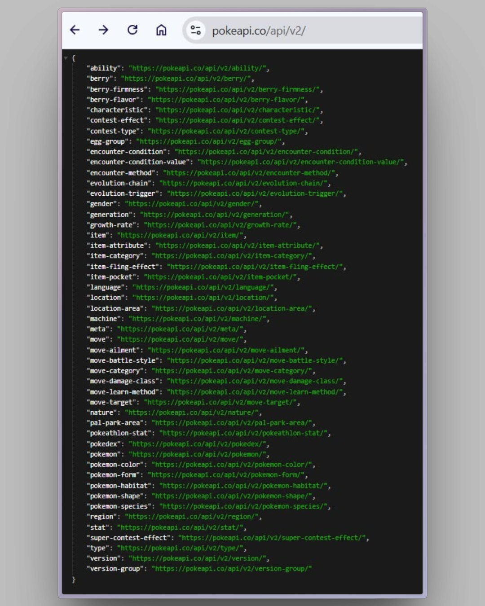

# 🌤️ PokeWeather Full Stack

A modernized 2026 version of the PokeWeather application. This project uses the user's location (city search) to determine the local weather and suggests a Pokémon of a matching type.

## 📸 App Preview

In this modernized version, the UI is clean, responsive, and fully localized in English. Below are some examples of the app matching weather conditions with Pokémon types:

| **Fire Type (Kuwait)** | **Ground Type (Lisbon)** |
| :---: | :---: |
|  |  |
| **Grass Type (São Paulo)** | **Ground Type (Tokyo)** |
|  |  |

> *Example of the logic: High temperatures (Kuwait) suggest Fire types, while mild temperatures suggest Grass or Ground types.*

---

## 🧠 Technical Implementation

### ☕ Backend (Java 21)
The backend was rebuilt using **Java 21 Records**, eliminating boilerplate code and ensuring immutable data transfer between the APIs and the frontend.

*   **Logic Service:** The core logic handles two external APIs (OpenWeather and PokéAPI) in a single flow.

*   **Modern DTOs:** Efficient data mapping with Records.

---

### 🅰️ Frontend (Angular 18)
The frontend leverages the latest Angular 18 features, such as the **Inject API** and the new **Template Control Flow**.

*   **Clean Architecture:** Separation of concerns between services and components.
*   **Modern Syntax:** Using `@if` for conditional rendering instead of legacy directives.

  
  
<i>VS Code showing the Angular 18 Standalone Component and Template.</i>

---

### 📊 Data & API Integration
The project integrates seamlessly with the PokéAPI, fetching real-time data to provide a diverse range of Pokémon for each search.

  
  
<i>JSON structure provided by PokéAPI used to map types and names.</i>

---

## 🛠️ Tech Stack
- **Language:** Java 21 (LTS)
- **Framework:** Spring Boot 3.3
- **Frontend:** Angular 18 (Standalone)
- **Styling:** CSS3 (Flexbox & Responsive Design)
- **External APIs:** OpenWeatherMap & PokéAPI
